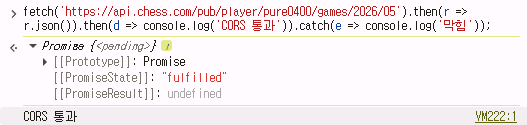

# 개발 이유
체스닷컴에서 돈 주고 분석하는 것보다 내가 분석하는 사이트를 만들려고 한다. 

# 핵심 기능
- 체스닷컴에서 기보를 가져와서 분석
- 내가 실수한 기보를 퍼즐로 만듦
- 내가 사용한 오프닝에 따른 승률을 보여줌
- 내가 자주 놓치는 전술의 통계를 보여줌
- 내가 스스로 분석한 것과 엔진이 분석한 것을 비교하여 점수를 매김

# 외부 소스
- 체스닷컴 API(게임 데이터 가져오기) : CORS 확인 
- 스톡피쉬 엔진(분석 엔진)
- chess.js (체스 규칙, PGN 처리)
- chessboard.js (체스판 UI 라이브러리)

# 참고 자료
- litrainer (내 게임 속 실수를 가져와서 퍼즐 형태로 보여줌)
- puzzle tagging system(퍼즐에 태그를 담)

### CORS 확인 코드
```
fetch('https://api.chess.com/pub/player/pure0400/games/2026/05').then(r => r.json()).then(d => console.log('CORS 통과')).catch(e => console.log('막힘'));
```



### 데이터를 어떻게 불러오지?
초기 1회는 최근 3개월 기록만 불러옴. 이후 더 불러오기 버튼으로 최근 1년 이내의 게임을 불러옴. 

### 데이터를 어떻게 저장하지? 
데이터를 퍼즐에서도 사용할 거고 통찰에서도 사용할 거임. 
컴퓨터 분석 시 필요한 정보를 저장. 나의 실수가 어느 단계에서 일어났는지, 어떤 오프닝을 사용했고 어떤 전술을 잘 못 봤는지
또한 실수 지점을 퍼즐로 저장. 
IndexedDB를 사용하여 브라우저 안에 저장하는 것도 생각해봤지만 Supabase를 사용하여 확장 가능성도 염두. 

### 컴퓨터 분석 방법
각 수의 포지션(FEN)을 하나씩 Stockfish에 넣고, 평가가 끝나면 결과를 저장. 
분석 중에도 화면이 멈추게 하지 않으려면 Web Worker를 사용. 